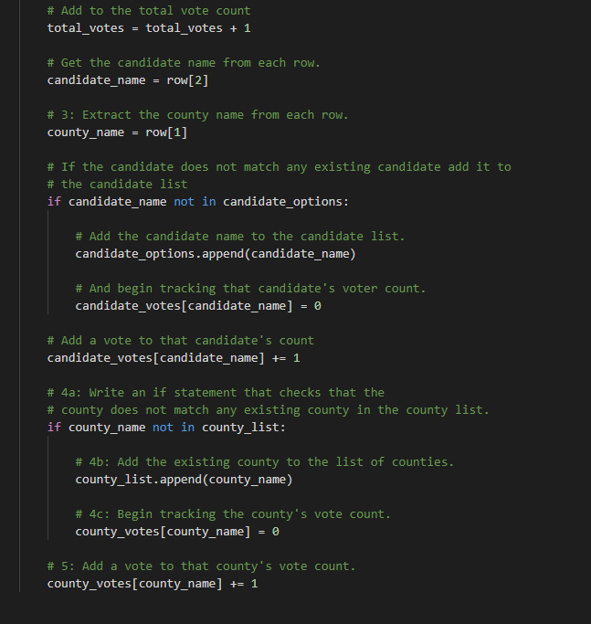
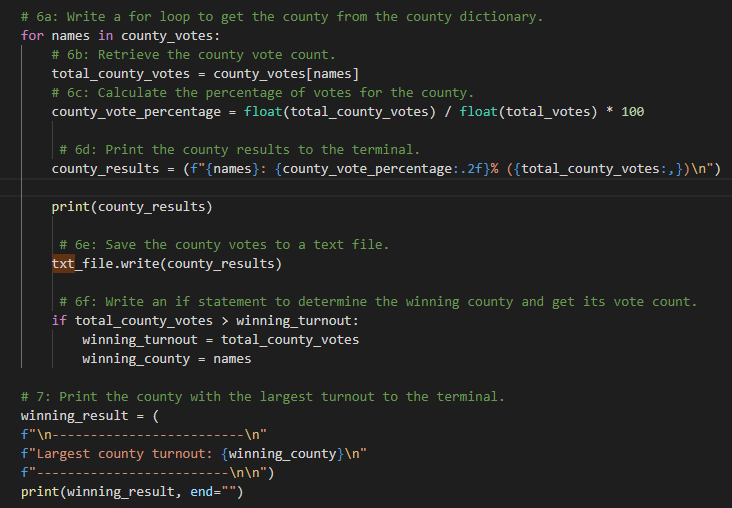
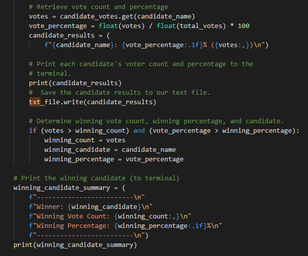

# Election-Analysis

## Overview of Election Audit: Explain the purpose of this election audit analysis.
The purpose of our election audit was to find the winner of the Colorado election but also provide further analysis on county by county and candidate by candidate analysis. With ~370k votes cast, our analysis allows us to better organize our data into useable outcomes printed out in our txt file. 

## Election-Audit Results: Using a bulleted list, address the following election outcomes. Use images or examples of your code as support where necessary.

### How many votes were cast in this congressional election?
There was a total of 369,711 votes cast in the election. As seen below this snipet is used throughout our analysis but in particular tallys votes for each candidate and at the same time adds +1 to total votes for each iteration as we move down the CSV file rows. 

### Provide a breakdown of the number of votes and the percentage of total votes for each county in the precinct.
County Votes:
Jefferson: 10.51% (38,855)
Denver: 82.78% (306,055)
Arapahoe: 6.71% (24,801)

 

Similar to our above code, this part helps us with two aspects of our analysis. Primarily we move through the CSV file and tally up each vote for each county, and at the bottom we compare our total county votes to see if it is greater than our winning turnout. If it is, we can conclude that is the winning county (this changes as the for loop runs but eventually the winning county will end up greater).
### Which county had the largest number of votes?
Denver had the largest number of votes. The code above is used to find this. That snipet shows how we tally each county up and then compare them to find the winning county which is then printed into our .txt file. 

### Provide a breakdown of the number of votes and the percentage of the total votes each candidate received.
Charles Casper Stockham: 23.0% (85,213)
Diana DeGette: 73.8% (272,892)
Raymon Anthony Doane: 3.1% (11,606)

### Which candidate won the election, what was their vote count, and what was their percentage of the total votes?
Diana Degette won the election by a landslide. Her vote count was 272,892, 73.8% of the votes! 

 

Similar to the way we tallied our county votes and found top counties with the same method we applied this to candidate analysis. The snipet above is able to allocate each vote from our CSV file to each candidate, and then compare the totals to find the greatest.

## Election-Audit Summary: In a summary statement, provide a business proposal to the election commission on how this script can be used—with some modifications—for any election. Give at least two examples of how this script can be modified to be used for other elections.

Our script can certainly be used for future elections no matter the size or complexity. Firstly, without any modifications this election can handle analysis on elections with more than 3 candidates or counties. Since we did not set candidate names or counties as givens to be counted, the code finds these names and counties itself and tallies them. This means it can be used in more intricate state elections that would have millions of votes and dozens of counties! 

Some modifications I would suggest for further analysis would be adding similar code which could categorize each vote by party lines (if applciable) as well as finding the split of party votes by county. This could easily be added with similar code we used to count county votes with the addition of a party variable. 

In addition, as we just had a presidential election, there are some modifications we could make for this script to work for a country wide election! Firstly, we would need to add a state counter so that we could attribute each vote to the given state. This could be done two ways. We could either split each state into their own CSV doc so that analysis would default to count each county in a state. Alternatively we could add additional analysis before our county count script which would count and attribute votes to their given state and then run those totals into our county analysis. 

There are endless posbilities for how our script could be modified, but even without modifications it is very flexible to be used in similar elections regardless of scope or county complexity!

python
